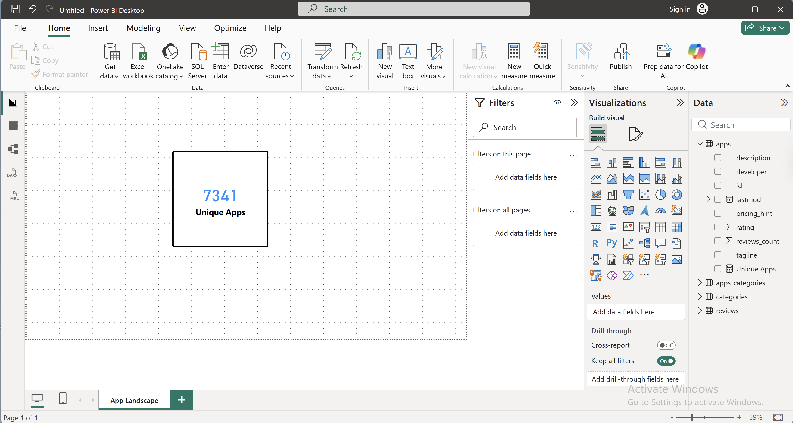
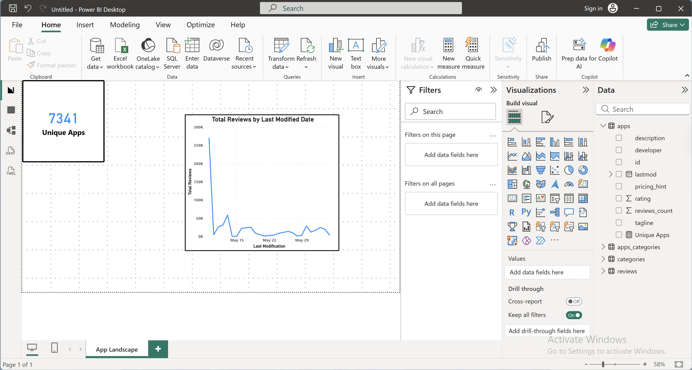
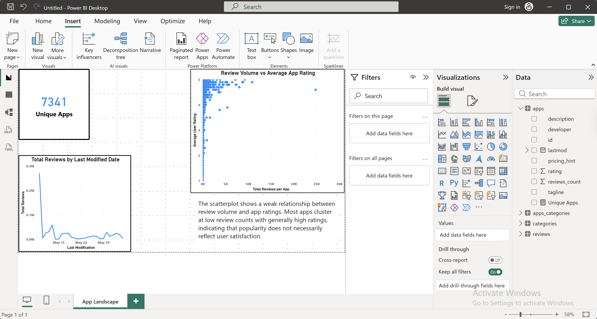
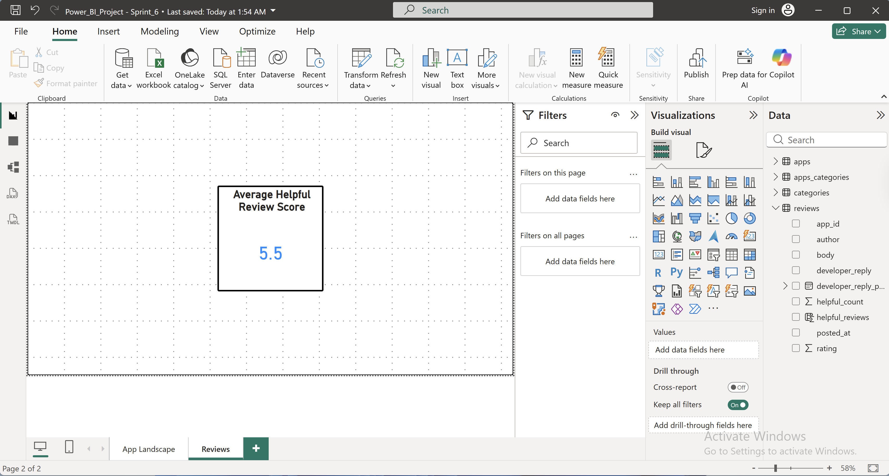
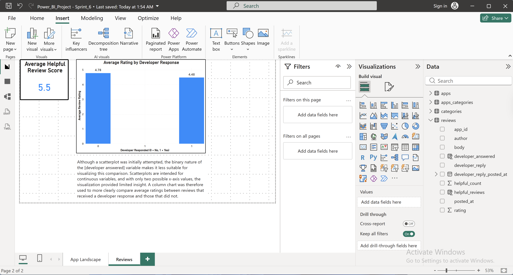
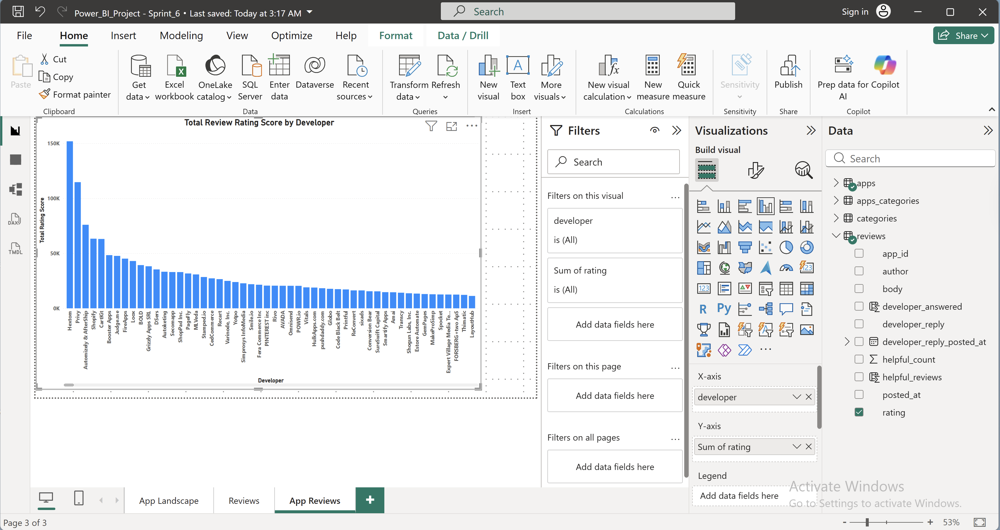
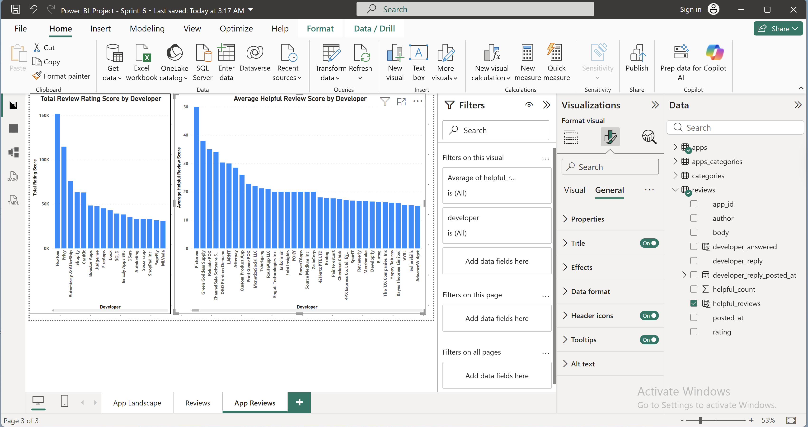
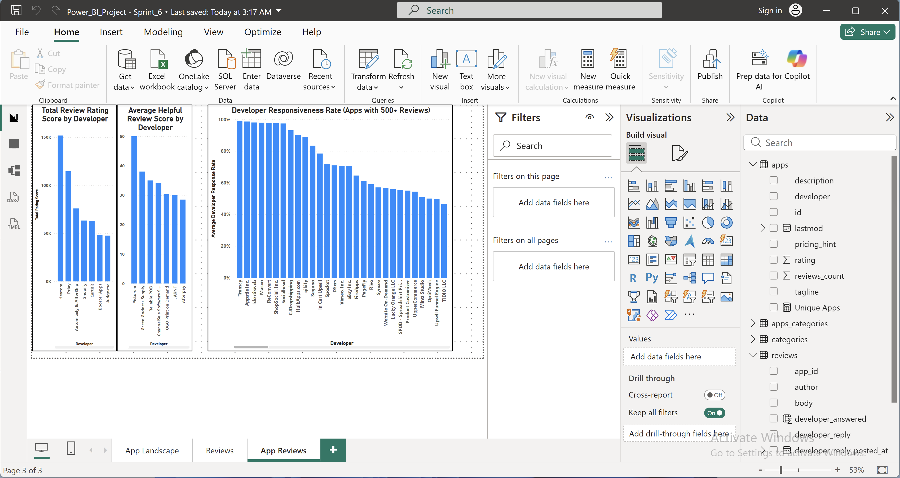

# Shopify App Store Analysis

## Project Overview

This project analyzes the Shopify App Store ecosystem using Power BI to identify key factors that contribute to app success. The analysis examines app performance metrics, user review patterns, and developer engagement to provide actionable insights for stakeholders in the Shopify marketplace.

**Tools Used:** Power BI Desktop  
**Skills Demonstrated:** Data Modeling, DAX Calculations, Data Visualization, Business Intelligence

---

## Table of Contents

- [Business Problem](#business-problem)
- [Data Source](#data-source)
- [Approach](#approach)
- [Key Findings](#key-findings)
- [Visualizations](#visualizations)
- [Conclusions](#conclusions)
- [How to View This Project](#how-to-view-this-project)

---

## Business Problem

The Shopify App Store hosts thousands of applications, but understanding what drives app success remains challenging. This analysis aims to answer:

- What is the current landscape of apps on the Shopify platform?
- How do review volumes and ratings correlate with app success?
- Does developer engagement (responding to reviews) impact app ratings?
- Which developers demonstrate the highest levels of user engagement and satisfaction?

These insights can help app developers, Shopify, and potential investors make data-driven decisions about app development and marketplace strategy.

---

## Data Source

The analysis uses publicly scraped data from the Shopify App Store, consisting of four interconnected tables:

- **apps**: Details of 7,341 unique applications including developer, review counts, and modification dates
- **apps_categories**: Junction table linking apps to their respective categories
- **categories**: Classification system for app types
- **reviews**: User reviews including ratings, helpful counts, and developer responses

---

## Approach

### 1. App Landscape Analysis

I began by establishing baseline metrics to understand the marketplace scope:

- Created a KPI card to quantify the total number of unique apps
- Analyzed review volume trends over time to identify growth patterns
- Examined the relationship between review quantity and rating quality



The initial KPI shows **7,341 unique apps** currently available on the Shopify marketplace, establishing the scale of the ecosystem.



The line chart reveals review volume patterns across the last modification dates, showing periods of high user engagement and potential app update cycles.



The scatterplot analysis uncovered a weak relationship between review volume and ratings. Most apps cluster at low review counts with generally high ratings, indicating that popularity (measured by review volume) does not necessarily reflect user satisfaction.

### 2. Review Quality Analysis

To better understand review credibility and developer engagement:

- Created a weighted metric (`helpful_reviews`) that combines rating with community validation
- Developed a binary indicator (`developer_answered`) to track developer responsiveness
- Compared ratings between developer-responded and non-responded reviews



The average helpful review score of **5.5** provides a more nuanced quality metric by weighting ratings with their perceived helpfulness to other users.



This comparison reveals that reviews with developer responses have different rating patterns than those without, though the binary nature of the variable limits granular interpretation for visualization purposes.

### 3. Developer Performance Analysis

The final phase established data relationships and evaluated developer-level metrics:

- Built a many-to-one relationship between Reviews and Apps tables
- Created multiple views of developer performance to avoid misleading aggregations
- Filtered for statistically significant sample sizes (500+ reviews)



This initial view shows total rating scores by developer, but as noted in the analysis, this metric can be misleading since it doesn't account for review volume variability.



A more accurate representation uses average helpful review scores, providing better insight into true developer performance by normalizing for review count and weighting by community feedback.



This final visualization identifies the most responsive developers among apps with substantial user bases (500+ reviews), showing clear leaders in community engagement. Maintaining high responsiveness with large review volumes indicates strong customer service commitment.

---

## Key Findings

1. **Market Scale**: The Shopify App Store contains 7,341 unique applications, representing a substantial and competitive marketplace.

2. **Popularity ≠ Quality**: There is a weak correlation between review volume and average ratings. Apps with fewer reviews can maintain high ratings, while popular apps show varied quality levels.

3. **Developer Engagement Matters**: Apps where developers actively respond to reviews demonstrate different rating patterns, suggesting that community engagement is a measurable factor in app perception.

4. **Responsive Developer Identification**: Among high-volume apps (500+ reviews), certain developers maintain exceptional responsiveness rates approaching 100%, distinguishing themselves through consistent customer engagement.

5. **Review Weighting Importance**: Simple rating averages can be misleading. Incorporating helpful counts provides a more reliable quality signal by considering community validation.

---

## Conclusions

This analysis demonstrates that success in the Shopify App Store is multifaceted. While achieving scale (high review counts) is one dimension, maintaining quality, developer responsiveness, and community trust are equally critical. 

For app developers, the data suggests:
- Focus on quality over purely driving review volume
- Actively engage with user feedback to build trust
- Encourage helpful review ratings to build credibility

For Shopify and marketplace stakeholders:
- Consider weighting algorithms that account for review helpfulness
- Recognize and promote developers with strong engagement metrics
- Monitor review patterns as indicators of app health

---

## How to View This Project

### Prerequisites
- Microsoft Power BI Desktop (free download from Microsoft)

### Steps to Explore

1. **Clone or Download this Repository**
   ```bash
   git clone https://github.com/yourusername/shopify-app-analysis.git
   ```

2. **Open the Power BI File**
   - Navigate to the project folder
   - Open `shopify-analysis.pbix` in Power BI Desktop

3. **Explore the Interactive Dashboards**
   - The report contains three pages: "App Landscape," "Reviews," and "App Reviews"
   - Use the built-in filters to explore different developer segments
   - Hover over visualizations for detailed tooltips

### Repository Structure
```
shopify-app-analysis/
│
├── README.md                 # Project documentation (this file)
├── shopify-analysis.pbix    # Power BI report file
├── 1.png                    # App Landscape KPI screenshot
├── 2.png                    # Review trends line chart
├── 3.png                    # Review volume vs rating scatterplot
├── 4.png                    # Average helpful review score
├── 5.png                    # Developer response comparison
├── 6.png                    # Total rating by developer
├── 7.png                    # Average helpful review by developer
└── 8.png                    # Developer responsiveness rate
```

---

## About This Project

This analysis was completed as part of a business intelligence coursework, earning full marks for technical execution, analytical rigor, and presentation quality. The project demonstrates proficiency in:

- Advanced Power BI visualization techniques
- DAX formula creation for custom metrics
- Data modeling and relationship management
- Business problem decomposition and insight generation
- Professional documentation and presentation

---

## Contact

Richard Rivera Cartagena
[LinkedIn](https://www.linkedin.com/in/richard-rivera-cartagena/) · [GitHub](https://github.com/RichRC)
---

*Note: This project uses synthetic data scraped from publicly available sources for educational purposes.*
